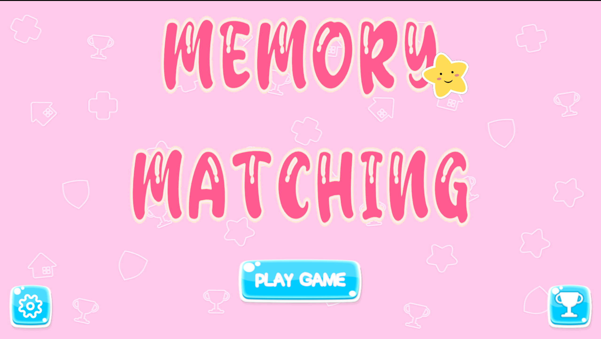
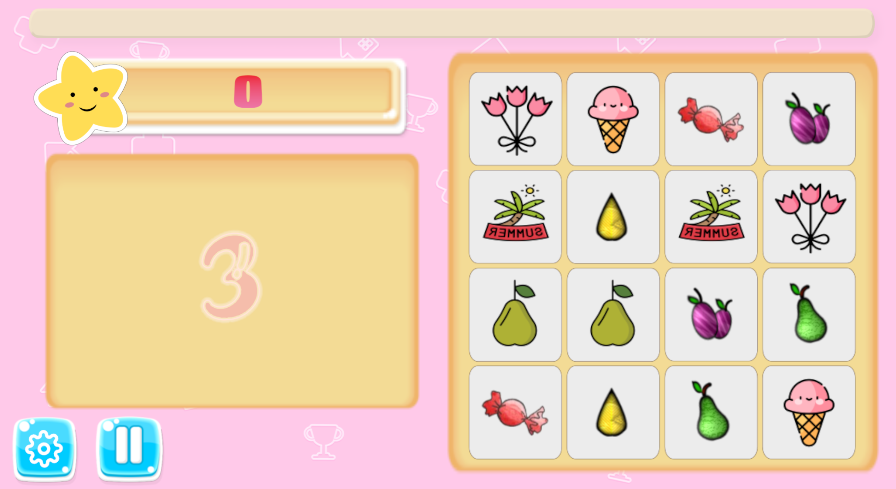

# Memory Card Matching Game :sparkles:
A simple but challenging game perfect for break time while insisting in powering up your memory. :magic_wand:

## Table of Contents
- [Demo](#demo)
- [Highlight Features](#highlight-features)
- [Installation](#installation)
- [Development](#development)
- [Team](#team)
- [Acknowledgements](#acknowledgements)
## Demo
### Main Menu Scene
Get started by navigating through our intuitive and user-friendly main menu.

## Main Game Scene
Dive into the main game scene and start matching cards to test your memory and improve your skills.

## Highlight Features
This project pays close attention to complete fundamental features of this traditinal game while enhancing the player's experience via friendly UI, eyecatching icons, navigation ease and soundtracks during the game.
### Simple and Intuitive Gameplay :star:
This game is designed to be simple and intuitive, suitable for all ages. The player's goal is to match all the cards in the shortest time possible. The game is over when all the cards are matched. 

No time limit is set for the game, so the player can take their time to memorize the cards and match them. 

The score unit added will be lower if too many wrong moves are made. If the player manage to have multiple correct moves in a row, the score unit added will be higher. The game will be over when all the cards are matched. The player can choose to play again or return to the main menu.
### Catching Soundtrack :sound:
Player can enjoy the game with the background music and sound effects. The background music is a relaxing and catchy tune that will help the player to focus and enjoy the game. The sound effects are added to make the game more engaging and fun. :dancer:

If the player wants to turn off the sound, they can easily do so by toggle off the sound or music icons :mute: in the setting panel. 
### Funny Memes :smile:
During the game, the player can enjoy the funny memes that are displayed when the player makes a move. The memes are designed to be funny and engaging, making the player enjoy the game even more.
### Easy Navigation :mag_right:
The game is designed with easy navigation in mind. The player can easily navigate through the main menu, settings, and game scenes. The player can also easily restart the game or return to the main menu at any time.
### Game Record Tracking :trophy:
All the game records are tracked and displayed in the record panel of the main menu scene. The player can see their top 3 best score. The game records are updated in real-time, so the player can see their progress and improvement over time.
> [!IMPORTANT]
> The game records are stored locally on the player's device, so they will not be lost when the player closes the game. However, if the player clears the game data, the game records will be lost.

>[!NOTE]
> All results are stored but we only display the top 3 best result. Further development can be made to display more results. (deliver graphs for better visualization of player's performance)
## Installation
Download this game within 3 easy steps: 
1. Navigate to the release page
2. Extract the files to a desired location.
3. Run the Unity-Memory-Game.exe file to start playing.

> [!CAUTION]
> The content of the release file may be flagged as contain viruses due to many executable files. 

> [!TIP]
> User may have to turn off the Virus&Threat Protection to download the game,

## Development
Technologies: Unity, C#, JSON

Most scripts and relevant game objects are in folder [`Asset/`](./Asset)
#### **Animations** :dizzy:
This folder includes all the animation controllers created via Unity Editor, usually for basic and static animations such as Button Transition,...
#### **Prefabs** :clipboard:
This folder includes all the reusable objects or dynamic objects of the game.
#### **Resources** :gift:
This folder includes all the fonts, soundtracks, images or icons used within the game.
#### **Scenes** :book:
This folder includes 2 main scenes of the game.
#### **Scripts** :brain:
This folder includes all the logic of the game, which is further divided into 7 subfolders: Animations *(script-based)*, Data, Enums, Interfaces, Managers, Objects and UI.
  - **Data and Enum:** includes scripts specifying relevant data format and types for particular object (usually event types)
  - **Objects and UI:** includes scripts for objects and UI elements within the game. Most of these scripts are inherited from `MonoBehaviour Class` to implement  the behaviour of a certain element in the game.
  - **Managers:** Many Managers are created to control objects and UI element together. All of these managers are of `Singleton Design Pattern` to maintain consistency and ease.
  - **Interfaces:** Blueprints are created to implement the `Observer Design Pattern` within the game.

## Team :busts_in_silhouette:
| Name | StudentID | Profile |
| --- | --- | --- |
| Lam Mai Tuyen | 22521629 | [@Ailey-Prmil](https://github.com/Ailey-Prmil) |
|Nguyen Thi Thu Uyen | 22521643 | [@Uyen324](https://github.com/Uyen324) |

## Acknowledgements
### Soundtracks
- Background Music: The Cutest Bunny by Shane Ivers - https://www.silvermansound.com
- Other Sounds: https://www.chosic.com/free-music/all/

### Icons
- <a href="https://www.flaticon.com/free-icons/1" title="1 icons">1 icons created by pbig - Flaticon</a>
- <a href="https://www.flaticon.com/free-icons/ranking" title="ranking icons">Ranking icons created by Freepik - Flaticon</a>
- <a href="https://www.flaticon.com/free-icons/number-3" title="number 3 icons">Number 3 icons created by Triangle Squad - Flaticon</a>
- <a href="https://www.flaticon.com/free-icons/high-score" title="high score icons">High score icons created by tulpahn - Flaticon</a>

### Main UI
- [Free Game UI Asset - Itch.io](https://pzuh.itch.io/free-game-gui)
